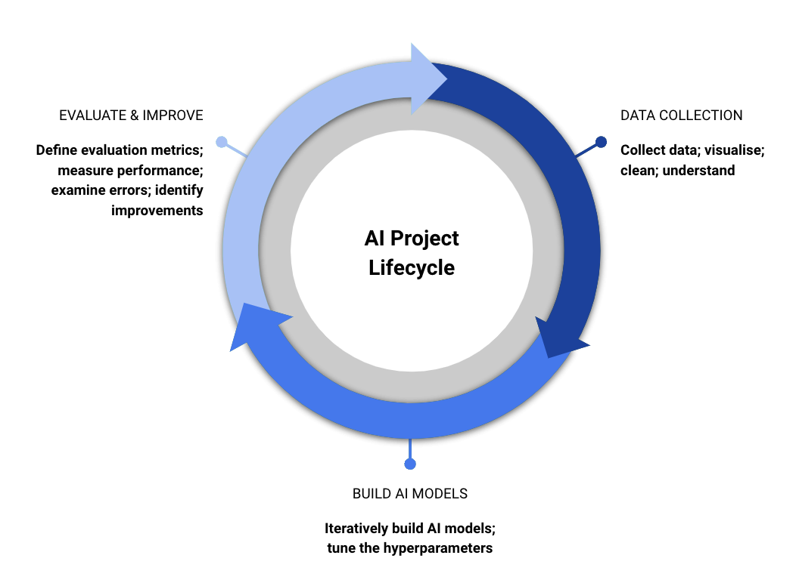

# The AI Project Lifecycle

## Learning Objectives
This section will help you understand:

- What AI projects look like in practice

## Building Machine Learning Models

Building a machine learning model starts at the outset with deciding on the task that you want to apply AI to. Clarity about what you aim to achieve with AI can help smooth the project and set you on the path to a successful outcome.

Before embarking on building AI models, it’s useful to identify any non-AI methods that might also be used to tackle the task. Simpler non-AI methods can be quick to try out and can make a good baseline from which to judge the performance of your AI approach. For example, with the example of identifying toxic and non-toxic molecules, it might be feasible to write a set of deterministic rules that quickly and easily make a rough determination of toxicity. AI can then be used to improve on this simple baseline.

At this early point in your project, it’s also helpful to think about any risks and concerns with your project that ought to be addressed from the outset.

Once you have identified a task and possibly a non-AI approach to begin with, the next step is identifying the type of AI algorithm that might be most suited for your task. From there, development in most AI projects follow the AI project lifecycle as follows:

{ align=center }

Building a machine learning model involves:

1. Collecting data; labelling that data, and doing any data pre-processing that’s required. The data is usually split into training, validation and test sets. 
2. Training a model on a '_training set_' of your data
3. Evaluating the model on a separate '_development set_', to see how well it does, looking into errors to find places for improvement. 

This tends to be an iterative process, not a linear one, so you may need to loop through these steps several times to get a model that works. It is sensible to start with simpler models and smaller datasets to get a working setup, before moving onto more complex models and large datasets. Diving straight into building a complex model on a large set can ultimately slow you down as it’s difficult to get right the first time. Building up complexity from a solid foundation is generally a more successful way to approach AI. One way to iterate around this project lifecycle loop can be in using increasingly larger and larger datasets. Another way can be in using increasingly more complex models. 

Once you have iterated around this loop and converged on a model that works well, you can evaluate its final performance on a held out '_test set_' to judge its real-world performance.

While most academic AI research focuses on gaining new insights and knowledge, much research work is done with the idea of a scenario in which the model might eventually be deployed. That might perhaps be in a hospital setting or embedded into a robot. That domain may come with restrictions and limitations such as how much computing power is available or how quickly the system must respond. There may also be specific workflows that experts in that domain follow and that you aim to fit in with. As your work progresses, these concerns about deployment will become more relevant.

It’s worth noting that several different approaches may be applicable to your task. For example, identifying supernovae in astrophysics data could be framed as a supervised learning task or as an anomaly detection task. Identifying tumours in medical images could be framed as a supervised learning task or as an unsupervised clustering task. The choice of algorithm can depend on the data you have available and the relative merits of the different algorithm options available to you.

For some fields, _patient and public involvement_ (PPI) is important. PPI is the idea that patients should be working with researchers to drive the direction of research and how the work is disseminated. How this is implemented varies from field to field, but is increasingly important as researchers use data-driven and AI techniques. Involving participants from the outset is important. 
The following sections dive into each segment - data, training & evaluation - of the AI project lifecycle in depth. 

## Contact

If you can't find what you need

[CONTACT US :fontawesome-solid-paper-plane:](mailto:accelerate-mle@cst.cam.ac.uk){ .md-button }

