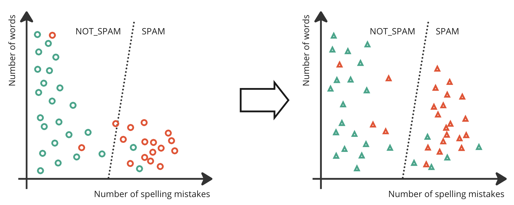

# Evaluating AI Models

## Learning Objectives
This section will help you understand:

- Using test data to robustly evaluate models
- Quantitative vs qualitative evaluation
- Evaluation metrics for different types of AI algorithms
- Error analysis tools including stratification, confusion matrices & ROC

## Overview

All machine learning models make mistakes. It’s important for researchers to carefully evaluate the performance of their AI algorithms. Evaluation happens continuously throughout an AI project to keep on track, and also is crucial for reporting and communicating your results with the world.

Consider a binary classification supervised model that's used to identify spam emails, and has been trained on a training dataset (circles). As the model weights have been trained using the training data, we can't use that data to see how well the classifier performs. That's a bit like seeing the exam questions ahead of time! To judge how well the classifier performs, we test its performance on a separate test set (triangles).

{ align=center }

AI models are usually evaluated and compared to a baseline. Your baseline could be a non-AI approach to solving the problem, or another AI method. It is important to include one or more strong baseline systems in your experiments to be sure that your AI method is the best approach to solving the task.

AI models are usually evaluated on a development set as models are iteratively improved during the project, and on a separate held-out test set at the end of the project. This is because continued improvements based on the development set performance leads, over time, to avoid overfitting to that dataset. By keeping a separate test set until the end of the project, you can get a better estimate of the model’s performance on unseen data. 

## Qualitative vs Quantitative Evaluation

There are two main approaches to evaluate how well your model is working

1. _Quantitative_ evaluations devise an automated metric which you can automatically compute on your test set to give a score
2. _Qualitative_ evaluations ask people to interact with your model and judge it

For some tasks, like toxicity detection, it’s feasible to automatically compute an accuracy metric. For other tasks, like summarising scientific papers, there are many possible correct answers and it's hard to find a good automated metric. Hence, the way to judge performance is by having people evaluate the summaries created by the model. However, qualitative evaluations carried out by people are expensive to perform and usually require an allocated budget in your project, to pay the people who are doing the evaluation.

In practice, researchers often lean heavily on automated quantitative evaluation metrics to evaluate their models. Those using qualitative evaluations do so on a much less frequent basis, typically only at key milestones.

## Evaluating Supervised Learning Models

There are a wide range of metrics in use for different tasks, so the best thing to do is to look at the literature related to your task to understand how others are evaluating performance. However, some common metrics exist. For classification:

- **Accuracy** is simply how often the classifier is right. This is computed by comparing the classifier's prediction against the ground truth human labels in a test set.
- **Precision** is a measure of how many of your positive classifications were correct. For the toxicity detection case, it's the proportion of molecules the model identified as toxic that actually were toxic.
- **Recall** tells you what proportion of your positives were correctly identified. For the toxicity detection case, it's the proportion of actual toxic molecules in the entire test set that the model correctly identified as toxic.

Interpreting these measures depends on the task being performed. A 95% accuracy rate may be acceptable in one task, but not in another. Accuracy can also be misleading when your data is highly skewed. For example, if your set of medical images has just 5% of images with a malignant tumour, then simply classifying all images as benign will give an accuracy of 95%.

[Precision and recall](https://developers.google.com/machine-learning/crash-course/classification/precision-and-recall) are usually reported together. An increase in one usually means a decrease in the other. For this reason, some researchers report the _f1-score_, which is a combination of precision and recall into a single metric.

For regression tasks,

- RMSE root mean squared error, is a measure of how far on average your predictions are from the ground truth label.

Researchers typically report a number of metrics to get a full picture of how their model performs. Accuracy, precision, recall and RMSE are widely used to evaluate the performance of different supervised learning models. However, there are many variants of these metrics, along with many other task-specific metrics for situations where these measures are too simple. Looking into the literature related to your specific task will be helpful to identify the specific metrics that are used in your domain. You'll need to use your judgement to select and interpret a particular metric. 

## Evaluating Unsupervised Learning Models

Anomaly detection problems are a type of classification, and so you may have a set of manually identified anomalies that you can use to measure accuracy, precision and recall, as is done for supervised learning.

However, judging the performance of other unsupervised learning models is more difficult than for supervised learning, because there are often no labels to judge against. Sometimes, the result of an unsupervised learning model is the input to another algorithm, and then it is important to measure the _downstream_ performance of that model on the task of interest. Sometimes, the result of an unsupervised learning model is a research hypothesis that must be tested experimentally. Even if that is the case, there may be multiple models and not all can be validated experimentally, so computational measures of performance are important to decide which hypotheses to take forward to test experimentally.

Classification is often evaluated by judging how well the proposed clusters match to the data. For each datapoint, _silhouette score_ measures the distance between that point and other points in the same cluster, the distance between that point and points in other clusters, and computes an overall score to judge the clustering fit. _Akaike Information Criterion_ (AIC) and _Bayesian Information Criterion_ (BIC) are measures that balance the complexity of the model with goodness-of-fit, and so can help with model selection because the best model simultaneously maximises fit but minimises model complexity. Another option is to compare the result of two clustering algorithms using a score like the _rand index_ which considers the proportion of points in the same cluster, or different clusters, in the two separate clustering results.

Dimensionality Reduction can be evaluated by looking at how much variance in the data remains and is captured by the lower-dimensional representation. How to measure this depends on the algorithm used. For example, PCA computes eigenvalues, which can tell you the proportion of variance explained by the lower dimensional space. For cases when dimensionality reduction is an input to a supervised ML algorithm, then the performance of that model can be tested using different dimensionality reduction algorithms for input. Similarly, if used as input to a clustering algorithm then the measures of clustering performance can be examined for different numbers of low-dimensional spaces.

In general, there are many ways to judge the performance of unsupervised learning algorithms, some of which are highly specific to the task at hand. It is always worth checking literature in your field and related work to determine if there are commonly used evaluation methods. 

## Evaluating Reinforcement Learning Models

It isn’t usually possible to create a test set to evaluate how well a reinforcement learning algorithm performs due to the complexity of the environment they operate in and the vast number of possible actions they can take. Reinforcement learning models are typically evaluated by performing the task that they’re trained to do. If there is a clear definition of whether the agent has succeeded or failed - such as a robot safely performing a specific task in a lab - then the success rate at that task can be measured. Alternatively, over a number of runs of the model in a realistic environment or simulation, the average or cumulative reward can be computed.

Depending on the task that the agent is performing, there may be other metrics that are commonly used in your discipline. Looking at the literature and similar work in your field can help guide your evaluation.

## Evaluating Generative AI Models

AI scientists are still figuring out good ways to evaluate generative AI models, especially for more general purpose AI models that can perform multiple tasks.

Evaluation metrics might aim to measure a general performance aspect of a model or its accuracy on a _downstream_ task. For measuring general performance, large language models may measure the _perplexity_ of the model on a held-out set of text data. This is an easy-to-compute measure of how well the model fits that text data. However, perplexity doesn’t tell you anything about how useful the model is in carrying out other tasks. A downstream task might be something like multiple choice question answering, or a text classification task for which you can compute accuracy, precision and recall. Current LLMs are typically evaluated on a raft of these downstream benchmarks, across a range of tasks and domains.

Still, these benchmarks only judge the kind of task which can be automatically scored because the correct behaviour is known. Researchers have devised automated metrics for more complex tasks, like summarisation or translation. However, these metrics have some limitations and model performance on complex tasks can only be thoroughly judged by a person. 

## Error Analysis

Usually, you 'll want to look deeper at the kind of errors that a model is making, in order to identify places where you can improve. Simply looking through the model’s predictions can yield some useful insights into how the model is performing. Some other useful ways to view errors are:

- **Confusion matrix** a plot for classification tasks showing which categories were confused with each other.
- **ROC** a graph that shows classification error as you trade off precision and recall
- **Stratification** of your test data into different subgroups, to compute the error on those. This can help identify sub-populations with different performance, helping to identify bias in your algorithm.
- **Confidence intervals** can give you an insight into the likely margin of error of your predictions
- **Statistical significance** can tell you how likely it is that changes in your model are caused by chance, or by having an improved model.

Error analysis can point to places where you can improve your experimental setup and achieve a better model performance. Perhaps you notice that your model doesn’t work well for a specific sub-population, and you can acquire additional training data for that group. Or perhaps you identify from the confusion matrix that two categories are often confused and can make a decision about whether there should be two separate categories or whether they ought to be merged into one. 

This effort of examining the model’s errors in detail forms a large part of a scientist’s work. While computing metrics can give you a headline figure about the performance of your model, the time spent looking at errors can be valuable to track down improvements and build performant AI models. 

## Contact

If you can't find what you need

[CONTACT US :fontawesome-solid-paper-plane:](mailto:accelerate-mle@cst.cam.ac.uk){ .md-button }

