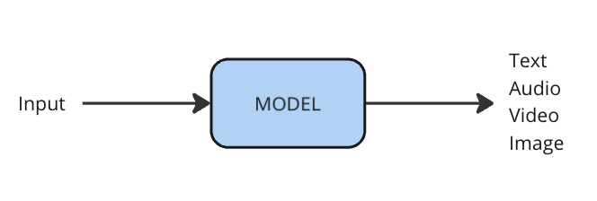

# Generative AI

## Learning Objectives

This section will help you understand:

- What generative AI is, and where you can use it
- What frontier or foundation models are and the pros & cons of using them
- Some real-world examples of generative AI in research

## Overview
Since 2017, there has been a lot of work in the area of generative AI. Broadly speaking, generative AI refers to models that generate content, usually in the form of images, text, video or audio.

{ align=center }

In many ways, generative AI is similar to supervised learning. The models output predictions that are content. However, for the kinds of content that is popular with Generative AI, there are orders of magnitude more data available online than for other tasks. This has meant that organisations can build larger and larger models, with massive training data sets. 

Generative AI was spurred on recently by the introduction of the transformer model (a kind of neural network) in 2017, and more recent work in building large models. In the field of natural language processing (NLP), transformer models have had a huge impact. Generative AI with text comes from language modelling - the task of predicting the next word in a sentence. This is a supervised learning task, where the task is given a sequence of words, predict the next word. However, it doesn’t require large amounts of effort to label data, because “next word” is inherently there in the data. This model is a very powerful autocomplete model. 

What’s interesting about Generative AI models for NLP is that when trained on large amounts of data, they are able to do several tasks that they weren’t explicitly trained to do. Or, they can be fine-tuned to do a task with a small amount of data - far smaller than the amount of data that’s needed to build a supervised model from scratch. These models are the basis of ChatGPT. 

## Frontier/Foundation Models

As organisations have trained increasingly larger and larger models, they have got more expensive to train. A typical way of working now is that these large ‘_foundation models_’ trained once by an organisation with the money and resources to do so, and then used by many others.

There are some considerations to take into account when using foundation models:

- We do not usually know the data they're trained on
- If a model is behind an API, we cannot be sure about reproducibility
- These models are typically trained on large amounts of data from the internet, which brings with it societal biases that become embedded in the model
- There's a large environmental cost to using these models

You might hear the term self-supervised to describe these models, because the supervision signal is from within the data itself rather than being labelled by a human. 

## Inspiration

## More Resources

Accelerate Science has two workshops related to generative AI, each with online material that you can work through at your own pace:

- LLMs
- Diffusion Models

## Contact

If you can't find what you need

[CONTACT US :fontawesome-solid-paper-plane:](mailto:accelerate-mle@cst.cam.ac.uk){ .md-button }

