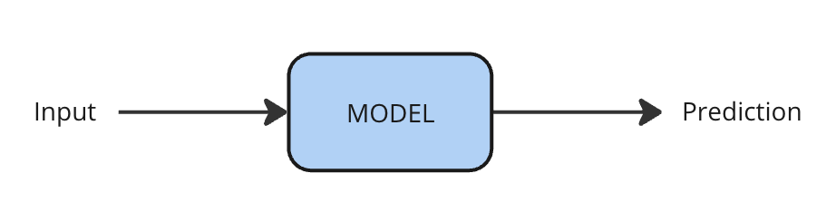
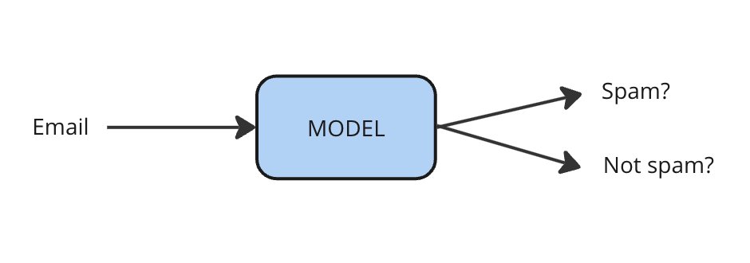
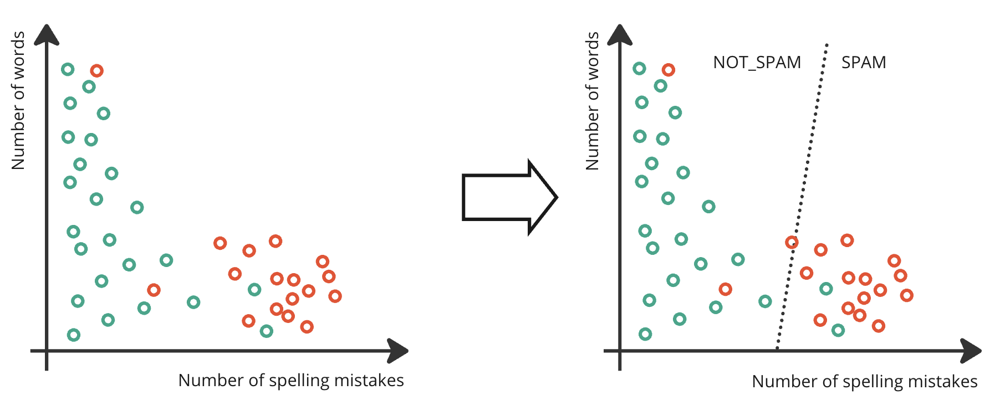
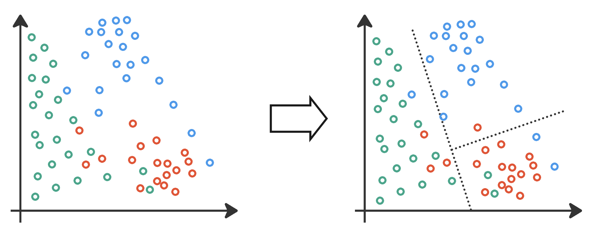
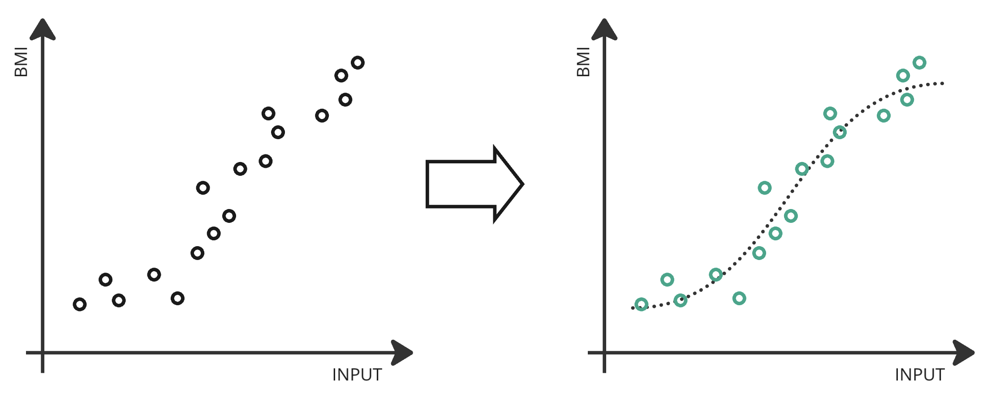
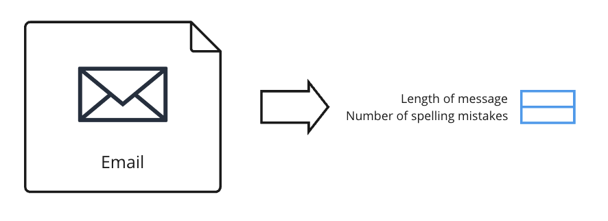
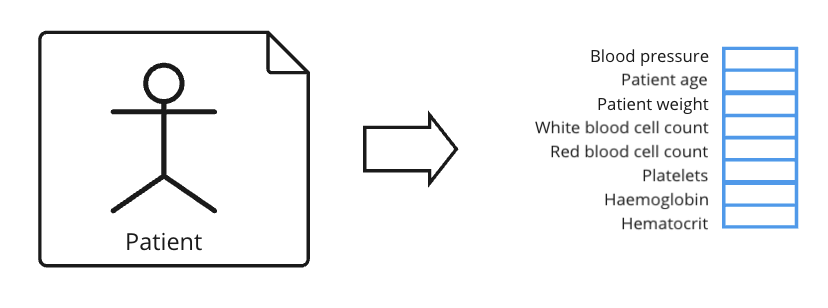

# Supervised Learning

## Learning Objectives

This section will help you understand:

- What supervised learning is, and where you can use it
- The difference between classification and regression
- Some of the supervised learning algorithms you might encounter
- Some real-world examples of supervised learning in research

## What is supervised learning?

Supervised learning is the most widely used type of machine learning algorithm, and it’s been widely applied across scientific fields. For example, in Chemistry it’s been used to predict the outcomes of reactions, in Materials Science to predict properties of new materials, in Climate Science for weather forecasting, in Biology for identifying cell types, and in Medicine for segmenting and classifying medical images.

Supervised learning has a broad range of applications in science, providing powerful tools for prediction, classification, and analysis. It enables researchers to extract insights from complex datasets, driving advancements across scientific disciplines.

Supervised models make predictions about their inputs. They learn how to make those predictions from a dataset of examples that are labelled with the correct prediction (also called the _ground truth_). One downside of supervised learning is that the dataset of examples can be expensive to obtain, especially if a person has to take the time to go through the data and manually annotate each example with its label.

{ align=center }

When designing a supervised learning algorithm, researchers need to define what the input and output of a model should be, to obtain the labelled data for training, and then train the model to make accurate predictions.

One example of supervised learning is predicting whether an email is spam or not. In this example there are two _categories_, or _classes_ to which an email might belong: SPAM and NOT_SPAM. A supervised learning algorithm for identifying spam emails would be trained on a dataset of emails labelled by whether they really are spam messages or not.

Machine learning models cannot directly accept email text as input, so numerical features are first extracted from each of the emails. Two features might be, for example, the length of the email, the number of spelling mistakes.

{ align=center }

By training the model directly on a dataset of emails that have been labelled as being spam or not, the model can learn the patterns that identify the two types of email, and then predict for a new email whether it is spam or not.

## Classification and Regression

Supervised learning can either be **classification** or **regression**. You will need to choose between these two modes depending on the task you are modelling and the data you have collected.

**Classification** is where the output of the model is one of a fixed number of categories. This could be a binary classification task where there are exactly two possible outputs, like the example above of spam email detection. Another example of a binary classification task is that of predicting whether a new drug candidate is toxic or not. You can think of the model as finding a line to separate the two classes, as shown here:

{ align=center }

Usually, there's some overlap between the two classes, so it’s not possible for a model to completely separate them. In the example above, some examples of spam email fall to the left of the line and are misclassified as non-spam, while some examples of non-spam email fall to the right and are wrongly identified as spam. This example also shows the model as a straight line separating the two classes. Typically, supervised learning models find a way to separate the classes that’s more complex than a straight line.

A different task might have multiple categories that an input could belong to. For example, recognising the face of a person in a photo. There are many possible people who could be pictured in the photo, and each person is a possible category. In Physics, a multi-class classification task could be galaxy classification, classifying the type of galaxy in an image. In this example, the classifier learns to separate three categories:

{ align=center }

Sometimes the number of classes can be very large, even into the thousands or millions, as is the case with many language processing tasks. Automatically translating text from one source language to another target language is a supervised task, where the model predictions are words in the target language. As languages have many thousands of words, then the number of output classes is also in the thousands. 

In other scenarios, an input might have more than one label. For example, a photo might have two or more different people in it, and we'd like to identify each. This is called _multi-label_ classification, because each photo has more than one label associated with it.

**Regression** is similar to classification, except that the output is a continuous number rather than a discrete class. An example might be predicting the BMI of a patient based on blood test biomarkers. Fitting a line of best fit is a simple kind of regression, as in this example:

{ align=center }

## Feature Extraction

Machine learning models require numerical inputs, and you'll need to consider that in designing your setup. Some tasks naturally have numerical inputs, or _features_, already - whether that's data from sensors, medical tests, pixel values or some other kind of data that's naturally a number. In other tasks, like in text processing, we need to convert our input to numbers by extracting features.

For the spam email task described above, we extract two features from each email, giving a 2-dimensional feature vector:

{ align=center }

In a different task, in an example clinical setting, there might extract eight features about each patient, and they’re combined into an 8-dimensional feature vector:

{ align=center }

In other scenarios, the feature vectors might have hundreds or thousands of dimensions. Perhaps you have a sensor measuring many readings, or lengthy gene expression data in a bioinformatics task. Still, whether you have a small number of features, or many thousands, the first task is to convert it into numbers that can be input to a machine learning model. 

## Examples of Supervised Learning

Examples of supervised learning tasks include:

| Task | Input | Prediction |
| ---- | ----- | ------ |
| Identify and segment tumours in medical images | Medical images | Areas in the image corresponding to tumours |
| Predict patient's BMI from biomarkers | Biomarkers | BMI |
| Predicting whether a new drug candidate is toxic or not | Chemical formula | Toxicity |
| Medical Diagnosis | Biomarkers, test results etc. | Diagnosis |
| Automated transcription | Audio files | Written transcription |
| Machine translation | Text in the source language | Text in the target language |

## Types of Supervised Learning Model

There are many supervised learning algorithms to choose between, and some of the common algorithms you might encounter are:

- Linear Regression
- Logistic Regression
- Linear Discriminant Analysis
- Decision Trees 
- Support Vector Machines
- Random Forests
- Neural Networks

Much of the recent excitement around AI focuses on neural network approaches. However, depending on your data and task, the other algorithms may be more practical to use. The choice of which algorithm to use will depend on several factors such as how much data you have, how complex your task is, and how much computational power you have available. In practice, researchers may try several different algorithms, starting with the simplest, and compare their performance to discover which works best. 

## Case Study

!!! abstract "Case Study: Supervised Learning in Healthcare"
    **Dr Chris Bannon**

    As medicine advances, we're now able to collect more and more data, and look in more detail at what's going on in our body. We're able to analyse blood samples to find the presence (or absence) of small amounts of hormones, peptides or other markers - many of which we weren't able to measure in the past because the technology wasn't sensitive enough. Then, we can begin to use AI to understand how these relate to disease.

    With a cohort of healthy volunteers and of patients with specific conditions, we use supervised learning algorithms to predict whether patients have that particular condition or not, based on features (markers) in their blood.

    In medicine though, it's not enough to be able to predict whether someone has a condition or not. It's important for clinicans to be able to understand _why_ a model is predicting a diagnosis. We need to know which of the various markers are most important, so we can do a better job of understanding and treating a condition. 

    As AI models get more complex, understanding how they make their decisions is increasingly harder. Hence, supervised learning algorithms like linear regression, decision trees and random forests are used in medicine. These algorithms not only let us predict a condition, but also allow us to look closer at what features, or markers, contribute to the decision. This understanding can inform future research. 

    The use of AI in medicine allows us to better understand our health, and how hormones contribute to disease, and to potentially discover new diagnostic blood tests that can be used in clinical practice. 

## Inspiration

Find more examples of research using supervised learning on Accelerate's blog:

- [Nicola Moloney talks about using supervised learning to predict where proteins are localised within a cell](https://acceleratescience.github.io/accelerate-spark%20data%20science%20residency/2021/06/24/NicolaMoloney-ML-for-parasitology.html)
- [Joyce Nakatumba-Nabende discusses how speech recognition can be deployed to help farmers in Uganda](https://acceleratescience.github.io/machine-learning/2024/01/08/how-can-we-use-ai-to-help-smallholder-farmers-in-uganda.html)
- [Yizhou Wan tells us how AI can be used to segment brain tumours in images, and to estimate their volume](https://acceleratescience.github.io/accelerate-spark-data-science-residency/2024/01/31/can-we-use-ai-to-better-treat-brain-cancer.html)
- [Chris Bannon hopes to predict whether someone's gut biome or metabolic marker levels are that of a healthy person, or whether they have a metabolic or bowel condition](https://acceleratescience.github.io/accelerate-spark-data-science-residency/machine-learning/2024/02/19/how-can-we-use-ai-to-advance-metabolic-medicine.html)
- [Dr Toby Jackson uses supervised learning to identify trees from satellite images, which can be used to track progress against the city’s goal to increase tree cover](https://acceleratescience.github.io/machine-learning/2023/10/16/how-can-we-use-ai-to-map-trees.html) 

## Contact

If you can't find what you need

[CONTACT US :fontawesome-solid-paper-plane:](mailto:accelerate-mle@cst.cam.ac.uk){ .md-button }

