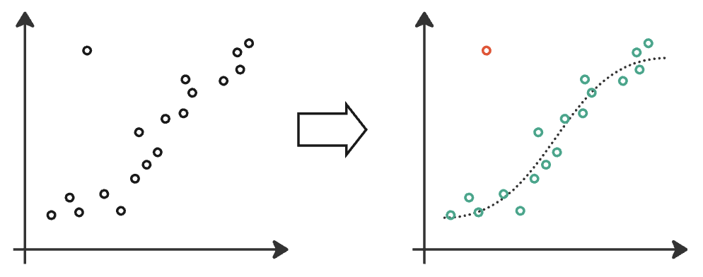

# Unsupervised Learning

## Learning Objectives

This section will help you understand:

- What unsupervised learning is
- Unsupervised learning algorithms including clustering, anomaly detection and dimensionality reduction
- Some real-world examples of unsupervised learning in research

## What is Unsupervised Learning?

Most data in the world is unlabelled. Unsupervised learning helps make sense of unstructured and unlabelled data. It’s been used across scientific fields, for example, in Medicine discovering sub-groups of participants in medical studies, in Physics identifying rare astrophysical events, and in Archeology grouping archeological sites to determine which might be related to each other.

Unsupervised learning is invaluable in scientific research for discovering hidden patterns, segmenting data, and reducing complexity in large datasets. It allows scientists to make sense of vast amounts of data and generate hypotheses that can be tested in further research.

Three common unsupervised algorithms are clustering, dimensionality reduction and anomaly detection. One or more of these algorithms may be helpful to you if you have unlabelled data to explore. 

## Unsupervised Learning Algorithms

Three common unsupervised algorithms are _clustering_, _dimensionality reduction_ and _anomaly detection_.

**Clustering**

Clustering is a technique that helps uncover structure in your data by discovering sub-groups within a larger dataset. It’s a technique that may be useful to explore if you believe that your data contains different sub-groups, and you’d like to discover them.

Across disciplines, clustering finds many applications. For example, you may be working with medical data about a specific treatment, and you notice that some people respond differently than others. If you don’t know the factors that drive this difference, then clustering may help you uncover different sub-groups that respond in different ways to the treatment. In Biology it can be used to group cells and identify distinct types of cell in the body. In the social sciences, individuals in behavioural studies can be grouped based on their behaviour. In Materials Science, materials can be grouped according to their similar behaviour in specific scenarios. 

{ align=center }

Unlike classification in supervised learning, where we know the groups ahead of time, clustering uncovers the unknown structure of sub-groups in a larger population. Clustering does not name the groups it uncovers, or provide any interpretation. Researchers must themselves examine and interpret the clusters to determine whether they are valid and useful, perhaps even by using the results to generate new research hypotheses to test experimentally.

There are many different clustering algorithms available to use. Two of the most popular and well-used are k-means clustering and DBSCAN. These are great starting points for any researcher interested in exploring clustering on their data. 

**Dimensionality reduction**

High dimensional data - ie data with a large number of features - is very common in scientific fields but is hard to work with. High dimensional data can come from different sources. Sensor data, weather data, large hadron collider data, spectroscopy, even survey data in the social sciences, can all generate many hundreds or thousands of features. Dimensionality reduction techniques are typically used in two ways - to visualise data, and to reduce the number of dimensions before applying another algorithm like clustering or supervised learning.

It is difficult to visualise high-dimensional data well so that you can explore what it looks like. Reducing the dimensionality of your data is one way to visualise it effectively. Projecting down from tens, hundreds or thousands of dimensions to 2- or 3-dimensions means that you’re able to plot your data on a graph to view.

{ align=center }

Principal Component Analysis (PCA), [t-SNE](https://distill.pub/2016/misread-tsne/), and [UMAP](https://pair-code.github.io/understanding-umap/) are popular dimensionality reduction algorithms that you might see used for visualisation of high-dimensional data.

A high number of dimensions also makes using algorithms like supervised learning and clustering difficult. High dimensionality data requires you to build models with a large number of parameters, to effectively model your data. The more parameters a model has, the more data you need. This is known as the _curse of dimensionality_. High dimensional data necessitates large datasets. 

Dimensionality reduction algorithms are often used on high-dimensional data to reduce the number of dimensions, before then using another algorithm like clustering or supervised learning. This low-dimensional representation of a higher-dimension space is called the _latent space_. For example, in Astrophysics, PCA has been used to reduce the dimension of spectroscopy data, before doing supervised classification to determine the type of stellar object. In Biology, PCA can be used to reduce the high-dimensional gene expression data, which can be thousands of features, to a low-dimensional latent space before doing further experiments.

High-dimensional datasets are common across scientific disciplines, and dimensionality reduction techniques allow researchers to reduce the complexity of their data to work with it more effectively. 

**Anomaly Detection**

Anomaly detection is identifying anomalous or rare examples in a dataset that are inconsistent with the rest of the dataset. Identifying rare events can be valuable in domains that generate lots of data, where you’re looking for a ‘needle in a haystack’, and doing so manually is very time-consuming. These rare events can then become the subject of future research. They can also be valuable when timely identification of an unusual event is crucial, like ahead of a natural disaster, when automated methods can be faster than a person.

{ align=center }

Scientific applications of anomaly detection include:

- Astrophysics - detecting short-lived events (known as transients) such as supernovae, or identifying scientifically interesting objects like exoplanets 
- Climate Science - identifying rare weather events or giving early signs of natural disasters such as predicting earthquakes from seismic data, or wildfire risk from weather patterns
- Medicine - identifying abnormalities in lab results e.g. triaging patients based on CT brain scans, or identifying malignant tumours as outliers in medical images

Anomaly detection can help researchers identify significant, unusual events that can lead to important discoveries, and provide early warnings for other scenarios.

!!! abstract "Case Study: Clustering in Cell Biology"
    **Dr Dinithi Sumanaweera**

    There are about 37 trillion cells in the human body. Cells come in many different shapes and sizes, with their own specialised roles - e.g. red blood cells, neurons, or muscle cells. Each cell carries a copy of one’s DNA, which instructs the cell to produce specific proteins. These instructions are encoded in genes, and the process of decoding these instructions and making proteins is called ‘gene expression’. The gene expression data of a cell can uniquely tell us what kind of cell it is.

     Due to the development of single-cell genomics technology, we are now able to record the gene expression of individual cells. This data forms a high-dimensional dataset. We first use dimensionality reduction techniques such as principal component analysis to create a low dimensional dataset. Then, we can identify clusters of cells that correspond to different cell types.

     While it is possible to use any clustering algorithm, the most common has been to first construct a k-nearest neighbourhood graph of the cells and run a community detection algorithm such as Leiden clustering or Louvain clustering. This can identify local neighbourhoods of cells that have similar gene expression profiles. These clusters characterise different cell types. A cluster could also capture a new cell type unknown to the community which can then be the subject of further research. We can also use the above low dimensional datasets to further reduce them down to 2D or 3D datasets for visualisation. These are often done using an algorithm like UMAP or tSNE.

     Scientists have been analysing gene expression data to identify and define diverse cell types in the human body. It is known that there are over 400 different types which have been identified, with more cell types yet to be discovered. These annotated datasets are indispensable for global cell atlasing efforts such as the [Human Cell Atlas](https://www.humancellatlas.org). 

!!! abstract "Case Study: Anomaly Detection in Astrophysics"
    **Dr Sireesha Chamarthi**

    In fields with vast datasets, like astronomy, anomaly detection is a critical tool for uncovering rare or unknown phenomena. For astronomers, anomalies could be anything from a supernova’s sudden brightness to an unusual galaxy shape. From finding new types of stars and galaxies, to detecting cosmic ray events and spotting exoplanets around distant stars. Telescopes capture billions of data points - petabytes of data - and manually finding anomalies isn't an option. 

    A critical initial step in anomaly detection for astronomical data is to validate the data and distinguish and exclude anomalies due to instrument or calibration issues, ensuring that remaining anomalies are of true scientific interest.
    
    Approaches to anomaly detection have evolved from traditional statistical methods to advanced machine learning and deep learning techniques. Statistical methods like Z-score and thresholding are simple but effective ways to flag outliers based on deviations from a statistical value. Machine learning has added more flexibility, with techniques like clustering techniques, Isolation Forest and Local outlier factors, which group similar data points and highlight those that don’t fit. Deep learning approaches, like autoencoders, are particularly valuable for high-dimensional data, allowing complex patterns to emerge that might not be visible through simpler methods.

    Automated systems that flag these anomalies in real-time allow astronomers to respond quickly, capturing data that might otherwise be missed. The vast scope of data in astronomy means that anomaly detection will continue to play an essential role in future discoveries. Tools specifically designed for astronomical data, such as Astronomaly, combine machine learning with active learning, where scientists provide feedback to refine detection models. This feedback loop enhances accuracy by prioritizing scientifically significant anomalies. As technology advances, these anomaly detection systems will increasingly help astronomers unlock the mysteries of the cosmos by identifying rare and impactful events across vast datasets.

## Inspiration

Find more examples of research using unsupervised learning on Accelerate's blog:

- [Ema Bauzyte discusses using unsupervised learning to cluster sites in archeology, get more insight about which might be related](https://acceleratescience.github.io/accelerate-spark%20data%20science%20residency/2021/06/10/EmBauztye-ML-for-archeology.html)
- [Jesse Allardice uses dimensionality reduction in Physics, to reduce the complexity of high dimensional data for solar panels](https://acceleratescience.github.io/accelerate-spark%20data%20science%20residency/2021/07/08/JesseAllardice-ML-for-solar-tech.html)
- [Dr Romit Samanta groups patients to better identify subgroups of patients and understand how their biology relates to disease progression](https://acceleratescience.github.io/2022/05/17/how-can-we-use-ai-to-understand-acute-respiratory-distress-syndrome.html)

## Contact

If you can't find what you need

[CONTACT US :fontawesome-solid-paper-plane:](mailto:accelerate-mle@cst.cam.ac.uk){ .md-button }

